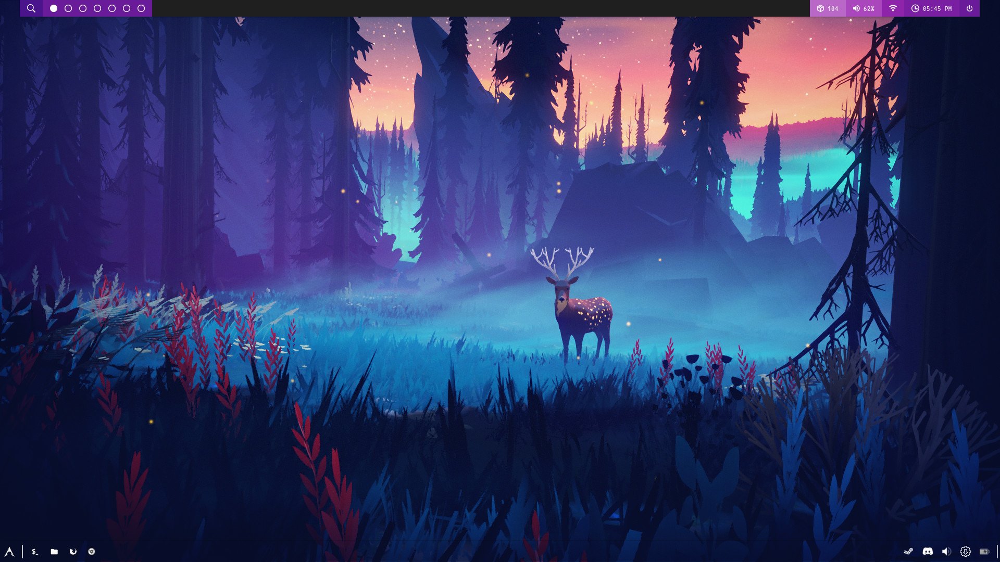

# Dotfiles
>These are my dotfiles for my configs 

## **Heads up**
these dotfiles are for ***ME*** and are  ***tailored for MY needs***,if they do not work on your machine that is your problem to solve. I will try to tidy things up so that it easy to figure out but you have been warned

Locations:
* Themes location /usr/share/themes/
* Icons location /usr/share/icons/
## Screenshots

